# SDK.finance Backend — Knowledge Transfer

---

## 0. Full Module Real Estate

The SDK.finance backend contains **54 directories** at the project root, with a total of **~7,000+ source files**. Below is the complete module map organized by architectural layer.

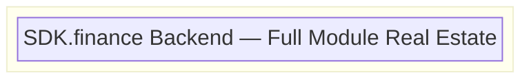

### Layer 0 — Foundation (`base/`)

The `base/` module (2,111 files) is the bedrock of the entire platform. Everything depends on it.

| Sub-module | Files | Purpose |
|-----------|-------|---------|
| `base/core/core-model` | ~500 | JPA entities: `Entity`, `Transaction`, `BusinessProcess`, `Coin`, `CoinDef`, `Currency`, `Organization`, `Member` |
| `base/core/core-manager` | ~400 | Repositories, persistence: `CoinRepository`, `SequenceComponentRepository`, Quartz integration |
| `base/core/core-services` | ~300 | Business logic: `CoinService`, `TransactionService`, `BusinessProcessService` |
| `base/core/core-endpoint` | ~100 | Shared REST endpoint infrastructure |
| `base/core/core-mapper` | ~50 | DTO ↔ Entity mappers |
| `base/core/core-utils` | ~50 | Shared utilities |
| `base/core/core-validation` | ~30 | Validation framework |
| `base/endpoint/endpoint-base` | ~29 | Base controller/endpoint classes |
| `base/environment` | 17 | Runtime environment configuration |
| `base/i18n` | 64 | Internationalization (multi-language support) |
| `base/message-template` | 16 | SMS/Email/Push notification templates |
| `base/migration` | 7 | Flyway database migration scripts |
| `base/dynamic-validation` | 25 | Dynamic, rule-based input validation |
| `base/transaction-viewer` | 66 | MongoDB-backed transaction read model (CQRS) |

---

### Layer 1 — Domain Modules

These modules implement business domains. They depend on `base/` and are orchestrated by the `application/` module.

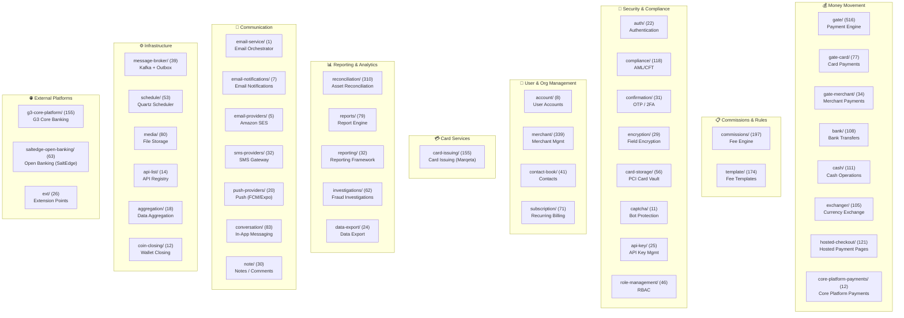

---

### Layer 2 — Gate Controllers (Payment Gateway Plugins)

Each gate controller is a **pluggable payment gateway adapter**. They implement `GateManager` interfaces and depend on the `gate/` service layer + their respective integration client.

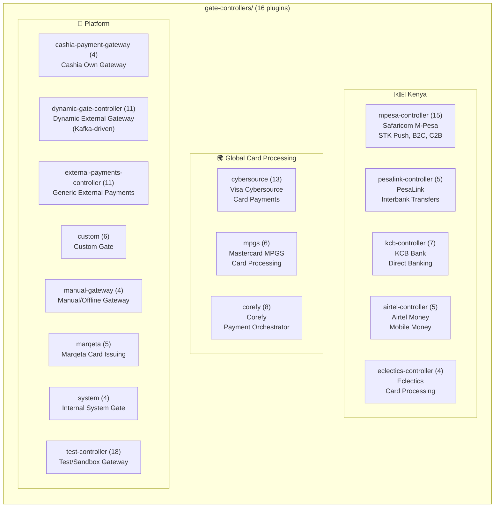

---

### Layer 3 — Integration Clients (External API Adapters)

Each integration module provides the HTTP client and data mapping to a specific external API. Gate controllers depend on these.

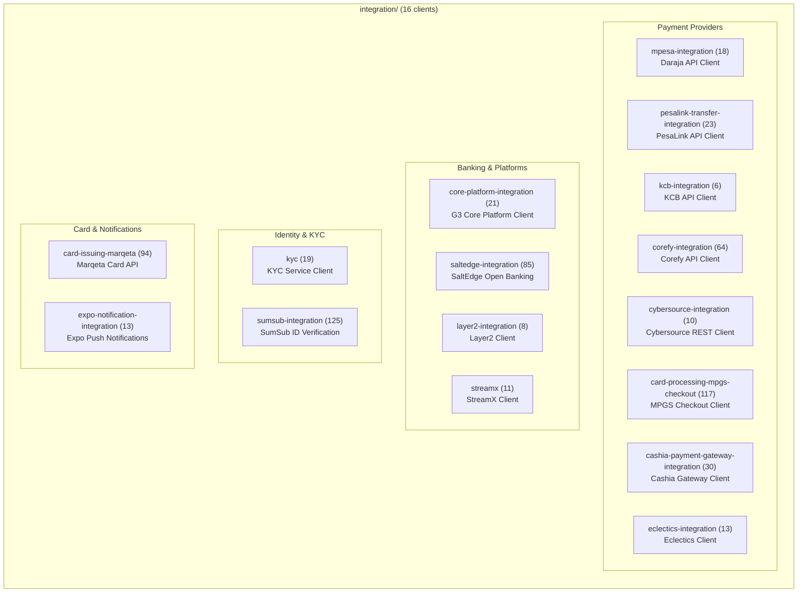

---

### Layer 4 — Application Assembly

The `application/` module (419 files) is the **Spring Boot main class** that assembles everything into a single deployable JAR.

```mermaid
graph TD
    APP["application/ (419 files)<br/>Spring Boot Main<br/>@SpringBootApplication"]
    
    APP --> BASE["base/ (2,111)"]
    APP --> GATE_MOD["gate/ (516)"]
    APP --> GC["gate-controllers/ (127)"]
    APP --> INT["integration/ (658)"]
    APP --> BANK_MOD["bank/ (108)"]
    APP --> MERCH_MOD["merchant/ (339)"]
    APP --> COMM_MOD["commissions/ (197)"]
    APP --> RECON_MOD["reconciliation/ (310)"]
    APP --> COMPLY["compliance/ (118)"]
    APP --> MSG["message-broker/ (39)"]
    APP --> SCHED["schedule/ (53)"]
    APP --> CARD_I["card-issuing/ (155)"]
    APP --> HOSTED_CO["hosted-checkout/ (121)"]
    APP --> G3_MOD["g3-core-platform/ (155)"]
    APP -.-> ALL_OTHER["... all other modules"]
```

---

### Full Module Inventory

| # | Module | Files | Layer | Description |
|---|--------|-------|-------|-------------|
| 1 | `base/` | 2,111 | Foundation | Core entities, services, repos, i18n, migrations, tx-viewer |
| 2 | `integration/` | 658 | Integration | 16 external API client modules |
| 3 | `gate/` | 516 | Domain | Payment gate engine (model, services, endpoints) |
| 4 | `application/` | 419 | Assembly | Spring Boot main + config + profiles |
| 5 | `merchant/` | 339 | Domain | Merchant management, onboarding |
| 6 | `reconciliation/` | 310 | Domain | Asset reconciliation engine |
| 7 | `commissions/` | 197 | Domain | Commission rule engine |
| 8 | `template/` | 174 | Domain | Fee/commission templates |
| 9 | `g3-core-platform/` | 155 | External | G3 core banking integration |
| 10 | `card-issuing/` | 155 | Domain | Card issuing (Marqeta) |
| 11 | `gate-controllers/` | 127 | Plugin | 16 payment gateway adapters |
| 12 | `hosted-checkout/` | 121 | Domain | Hosted payment pages |
| 13 | `compliance/` | 118 | Domain | AML/CFT compliance checks |
| 14 | `cash/` | 111 | Domain | Cash in/out operations |
| 15 | `bank/` | 108 | Domain | Bank transfers |
| 16 | `exchanger/` | 105 | Domain | Currency exchange |
| 17 | `conversation/` | 83 | Domain | In-app messaging/chat |
| 18 | `media/` | 80 | Infra | File storage (S3, GCS, local) |
| 19 | `reports/` | 79 | Domain | Report generation |
| 20 | `gate-card/` | 77 | Domain | Card payment flows |
| 21 | `subscription/` | 71 | Domain | Recurring billing |
| 22 | `saltedge-open-banking/` | 63 | External | SaltEdge Open Banking |
| 23 | `investigations/` | 62 | Domain | Fraud investigation workflow |
| 24 | `card-storage/` | 56 | Security | PCI-compliant card vault |
| 25 | `schedule/` | 53 | Infra | Quartz job scheduling |
| 26 | `role-management/` | 46 | Security | RBAC roles & permissions |
| 27 | `contact-book/` | 41 | Domain | User contacts/beneficiaries |
| 28 | `message-broker/` | 39 | Infra | Kafka + Outbox + BPM messaging |
| 29 | `gate-merchant/` | 34 | Domain | Merchant-specific gate logic |
| 30 | `reporting/` | 32 | Domain | Reporting framework |
| 31 | `sms-providers/` | 32 | Comms | SMS delivery (Africa's Talking, etc.) |
| 32 | `confirmation/` | 31 | Security | OTP, 2FA, confirmations |
| 33 | `note/` | 30 | Domain | Notes/comments on entities |
| 34 | `encryption/` | 29 | Security | Field-level AES encryption |
| 35 | `ext/` | 26 | Infra | Extension hooks |
| 36 | `api-key/` | 25 | Security | API key management |
| 37 | `data-export/` | 24 | Domain | CSV/PDF data export |
| 38 | `auth/` | 22 | Security | Authentication (native) |
| 39 | `push-providers/` | 20 | Comms | FCM, Expo push notifications |
| 40 | `middleware/` | 18 | Integration | PaaS middleware bridge |
| 41 | `aggregation/` | 18 | Domain | Data aggregation/dashboards |
| 42 | `api-list/` | 14 | Infra | API endpoint registry |
| 43 | `core-platform-payments/` | 12 | Domain | Core platform payment orchestration |
| 44 | `coin-closing/` | 12 | Domain | Wallet/coin deactivation |
| 45 | `captcha/` | 11 | Security | reCAPTCHA/hCaptcha |
| 46 | `account/` | 8 | Domain | User account management |
| 47 | `email-notifications/` | 7 | Comms | Email notification orchestration |
| 48 | `bank-catalog/` | 30 | Domain | Bank catalog/directory |
| 49 | `email-providers/` | 5 | Comms | Amazon SES email provider |
| 50 | `email-service/` | 1 | Comms | Email service interface |

---

### Data & Messaging Infrastructure Map

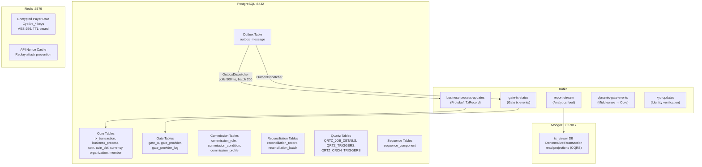

---

## 1. System Architecture Overview

The SDK.finance backend is a **modular Java monolith** built on Spring Boot (Java 17+), organized as a multi-module Maven project with **50+ Maven modules**. It follows a layered architecture per module (`model` → `services` → `endpoint`) and is designed as a **white-label payment platform** (PaaS).

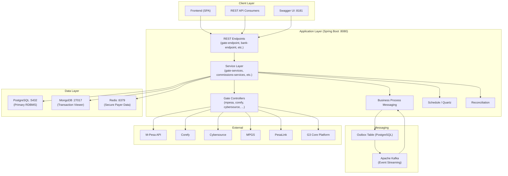

---

## 2. Database Architecture

### 2.1 PostgreSQL — Primary RDBMS

PostgreSQL is the **single source of truth** for all transactional data. Every JPA entity ultimately extends the base [Entity.java](file:///Users/muchami/work/cashia-sdk-finance-backend-main/base/core/core-model/src/main/java/sdk/finance/core/base/model/Entity.java) class.

**Key tables/entities:**

| Domain | Table | Entity | Purpose |
|--------|-------|--------|---------|
| Transactions | `tx_transaction` | `Transaction` | Immutable ledger entries between coins |
| Business Process | `business_process` | `BusinessProcess` | Container grouping multiple transactions into one atomic operation |
| Gate Transactions | `gate_tx` | `Tx` | Payment gateway transaction with external provider state |
| Coins/Wallets | `coin` / `coin_def` | `Coin` / `CoinDef` | User wallet balances (incoming/outgoing sub-ledgers) |
| Commissions | various | various | Fee rules, conditions, and computed commissions |
| Kafka Outbox | `outbox_message` | `OutboxMessage` | Transactional outbox for reliable Kafka publishing |
| Reconciliation | various | `ReconciliationRecord` | Asset reconciliation records |

#### 2.1.1 Optimistic Locking (`@Version`)

Every entity inherits a `@Version` field from the base `Entity` class:

```java
@MappedSuperclass
public abstract class Entity<T extends Serializable & Comparable<T>> implements Serializable {
    @Version
    @Getter
    private long version;  // Hibernate auto-increments on each UPDATE
}
```

This is **optimistic concurrency control**: Hibernate checks that the `version` column hasn't changed since the entity was read. If two threads read `version=5` and both try to update, the second one gets an `OptimisticLockException`. This is used **system-wide** for all entities, ensuring no silent overwrites.

#### 2.1.2 Pessimistic Locking (`LockModeType.PESSIMISTIC_WRITE`)

For critical financial operations where optimistic locking isn't sufficient (high-contention resources), the codebase uses **database-level row locks** via `SELECT ... FOR UPDATE`:

| Repository | Lock Type | Purpose |
|-----------|-----------|---------|
| [CoinDefJPARepository](file:///Users/muchami/work/cashia-sdk-finance-backend-main/base/core/core-manager/src/main/java/sdk/finance/core/persistence/repository/coin/CoinDefJPARepository.java) | `PESSIMISTIC_WRITE` | Lock wallet rows during balance mutations to prevent double-spend |
| [CoinRepositoryImpl](file:///Users/muchami/work/cashia-sdk-finance-backend-main/base/core/core-manager/src/main/java/sdk/finance/core/persistence/repository/coin/CoinRepositoryImpl.java) | `PESSIMISTIC_WRITE` + `OPTIMISTIC` | Hybrid: pessimistic for writes, optimistic refresh for reads |
| [SequenceComponentRepository](file:///Users/muchami/work/cashia-sdk-finance-backend-main/base/core/core-manager/src/main/java/sdk/finance/core/generator/SequenceComponentRepository.java) | `PESSIMISTIC_WRITE` / `PESSIMISTIC_READ` | Sequence ID generation — must be globally unique |
| [G3WalletWithdrawRequestRepository](file:///Users/muchami/work/cashia-sdk-finance-backend-main/bank/bank-services/src/main/java/sdk/finance/bank/repository/G3WalletWithdrawRequestRepository.java) | `PESSIMISTIC_WRITE` | Lock withdrawal requests to prevent duplicate processing |
| [G3GateProviderLogRepository](file:///Users/muchami/work/cashia-sdk-finance-backend-main/g3-core-platform/g3-core-services/src/main/java/sdk/finance/g3/gateprovider/repository/G3GateProviderLogRepository.java) | `PESSIMISTIC_WRITE` | Lock provider log entries during concurrent callback processing |
| [ReconciliationRecordRepository](file:///Users/muchami/work/cashia-sdk-finance-backend-main/reconciliation/reconciliation-services/src/main/java/sdk/finance/reconciliation/repositories/reconciliation/asset/ReconciliationRecordRepository.java) | `PESSIMISTIC_WRITE` | Lock reconciliation records during matching |

#### 2.1.3 Append-Only / Immutable Transaction Ledger

The [Transaction](file:///Users/muchami/work/cashia-sdk-finance-backend-main/base/core/core-model/src/main/java/sdk/finance/core/transaction/Transaction.java) entity is designed as an **append-only, immutable ledger entry**:

- All fields are `@Getter` only — **no setters** (except parent/child relationships)
- Uses `@DynamicInsert` and `@DynamicUpdate` (Hibernate only includes non-null columns in SQL)
- Extends `UuidCreatableEntity` — UUID primary key generated at creation time, with `creationAction` tracking who created it
- Models a double-entry system: `srcCoin → destCoin` with explicit `srcCoinDefIncoming`/`srcCoinDefOutgoing` sub-ledger tracking

```java
@DynamicInsert
@DynamicUpdate
@Entity
@Table(name = "tx_transaction")
public class Transaction extends UuidCreatableEntity {
    private TransactionType type;      // e.g., commission, commission_authorization, etc.
    private Coin srcCoin;              // Source wallet
    private Coin destCoin;             // Destination wallet
    private BigDecimal amount;         // precision=36, scale=20
    private BusinessProcess businessProcess;  // Parent container
    private CommissionDirection commissionDirection;
    // Parent-child TX hierarchy for commission trees
    private Transaction parent;
    private List<Transaction> children;
}
```

Once a `Transaction` row is inserted, it is **never updated or deleted**. Corrections are made by inserting **reversal transactions** (`commission_reversal`). This is a true **event-sourced ledger** — the current balance is always the sum of all transactions against a coin.

### 2.2 MongoDB — Transaction Viewer

MongoDB stores **denormalized, read-optimized views** of transactions for the `transaction-viewer` module. This is a classic **CQRS pattern**: PostgreSQL is the write model, MongoDB holds the read projections.

```
base/transaction-viewer/   ← reads from MongoDB (tx_viewer database)
```

The frontend queries MongoDB for transaction history/search while writes go to PostgreSQL.

### 2.3 Redis — Secure Payer Data Store

Redis is used in the gate module to **temporarily store encrypted sensitive payer data** (card numbers, PINs, etc.):

[SecureRedisStore](file:///Users/muchami/work/cashia-sdk-finance-backend-main/gate/gate-services/src/main/java/sdk/finance/gate/encryption/SecureRedisStore.java):
- Data is **AES-encrypted** before storage (`AESKeyHolder.encryptData()`)
- Entries have TTL (`Duration.ofMillis(expirationTimeMillis)`)
- Key prefix: `CybSrc_` (originally from Cybersource integration)
- Supports **key rotation** — re-encrypts all stored items with a new AES key
- Uses `SecureMemoryWiper.wipe()` to zero-out decrypted byte arrays after use
- Conditional: only active when `spring.redis.enabled=true`

[RedisConfig](file:///Users/muchami/work/cashia-sdk-finance-backend-main/gate/gate-services/src/main/java/sdk/finance/gate/config/RedisConfig.java) uses Lettuce connection factory with `StringRedisSerializer`.

---

## 3. Business Process Orchestration

### 3.1 The BusinessProcess Entity — Native Transaction Orchestration

A [BusinessProcess](file:///Users/muchami/work/cashia-sdk-finance-backend-main/base/core/core-model/src/main/java/sdk/finance/core/transaction/business/BusinessProcess.java) is the **central orchestration entity** that groups multiple `Transaction` entries into a single atomic business operation (e.g., a top-up that involves a principal transaction + commission transaction + fee transaction).

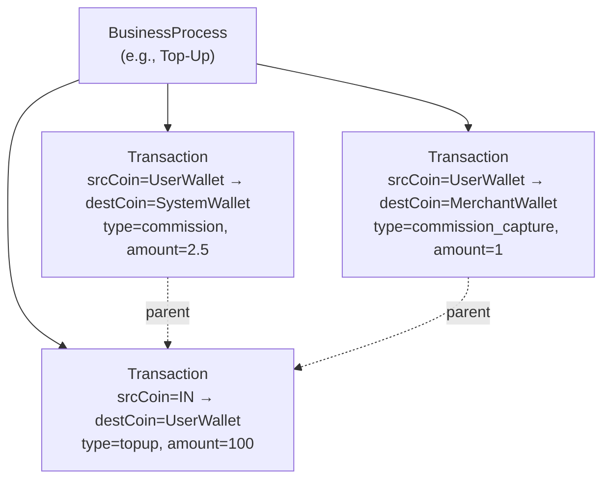

### 3.2 BusinessProcessStatus — Finite State Machine

[BusinessProcessStatus](file:///Users/muchami/work/cashia-sdk-finance-backend-main/base/core/core-model/src/main/java/sdk/finance/core/transaction/business/BusinessProcessStatus.java) implements `Transitionable<BusinessProcessStatus>` — a compile-time enforced state machine:

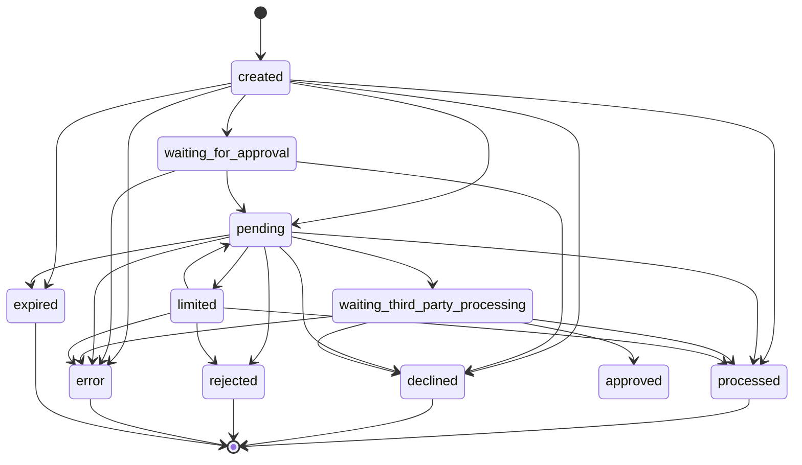

The `Transitionable` interface ensures that **only valid state transitions can occur** — calling `transitsTo()` in a static initializer defines the allowed edges. At runtime, attempting an invalid transition throws an exception.

---

## 4. Kafka & Event-Driven Architecture

### 4.1 Transactional Outbox Pattern

The system implements the **Transactional Outbox Pattern** to guarantee exactly-once delivery semantics between PostgreSQL and Kafka:

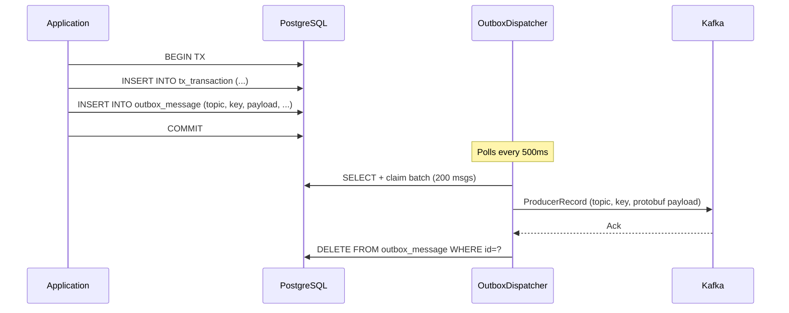

**Key components:**

- [OutboxMessage](file:///Users/muchami/work/cashia-sdk-finance-backend-main/message-broker/kafka/src/main/java/sdk/finance/kafka/outbox/entity/OutboxMessage.java) — JPA entity in `outbox_message` table with `messageId` (idempotency key), `aggregateType`, `aggregateId`, `payloadType`, and `payload` (BYTEA/protobuf)
- [OutboxDispatcher](file:///Users/muchami/work/cashia-sdk-finance-backend-main/message-broker/kafka/src/main/java/sdk/finance/kafka/outbox/OutboxDispatcher.java) — `@Scheduled(fixedDelay=500ms)` polls `outboxMessageRepository.claimBatch(200)`, sends to Kafka, deletes on success
- [KafkaTransactionStreamEnqueuer](file:///Users/muchami/work/cashia-sdk-finance-backend-main/message-broker/business-process-messaging/business-process-messaging-services-impl/src/main/java/sdk/finance/kafka/KafkaTransactionStreamEnqueuer.java) — implements `TransactionStreamEnqueuer` to enqueue business process records via `OutboxService`

### 4.2 Protobuf Serialization

All Kafka messages use **Protocol Buffers** for serialization. Mapper classes in [business-process-messaging-services-api](file:///Users/muchami/work/cashia-sdk-finance-backend-main/message-broker/business-process-messaging/business-process-messaging-services-api/src) convert domain objects to protobuf records:

| Mapper | Domain |
|--------|--------|
| `ProtobufGateProcessRecordMapper` | Gate transactions |
| `ProtobufBankProcessRecordMapper` | Bank transfers |
| `ProtobufCashProcessRecordMapper` | Cash operations |
| `ProtobufExchangeProcessRecordMapper` | Currency exchange |
| `ProtobufMerchantPaymentProcessRecordMapper` | Merchant payments |
| `ProtobufMonthlyFeeProcessRecordMapper` | Recurring fees |

### 4.3 Kafka Consumers

| Consumer | Module | Topic | Purpose |
|----------|--------|-------|---------|
| [TransactionStatusChangeConsumer](file:///Users/muchami/work/cashia-sdk-finance-backend-main/message-broker/business-process-messaging/business-process-messaging-services-impl/src/main/java/sdk/finance/kafka/transaction/TransactionStatusChangeConsumer.java) | business-process-messaging | `business-process-messaging.kafka.topic` | Handles sensitive operation status changes (e.g., compliance checks) |
| `TxStatusChangeConsumer` | business-process-messaging | Gate tx status topic | Gate transaction status changes |
| `TransactionReportStreamConsumer` | reports | Reports topic | Feeds reporting/analytics pipeline |
| `DynamicGateKafkaConsumer` | dynamic-gate-controller | Dynamic gate topic | External gateway transaction events |
| `KYCUserUpdateProfileListener` | kyc | KYC topic | User profile KYC status updates |
| `SumsubKycRequestDataListener` | sumsub-integration | Sumsub topic | SumSub KYC verification results |

---

## 5. Payment Gateway Architecture — The Gate System

### 5.1 Conceptual Model: System Gates vs. External Gates

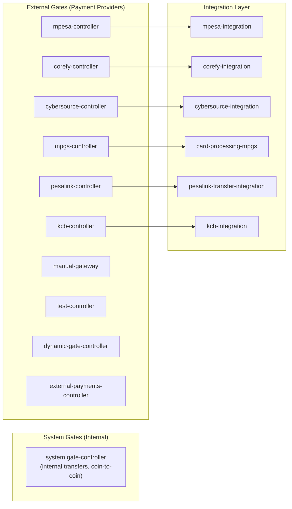

- **System gates** handle internal movements (wallet ↔ wallet) — no external API calls
- **External gates** communicate with third-party payment providers via the integration layer
- **Dynamic gate controller** — a generic controller for dynamically-registered external gateways

### 5.2 The Plugin Architecture — GateManager Hierarchy

The gate system follows a **Strategy + Plugin** pattern. Each payment gateway implements a set of interfaces from a well-defined hierarchy:

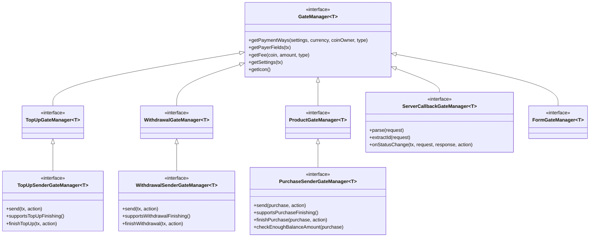

**Key interfaces:**

| Interface | Purpose |
|-----------|---------|
| [GateManager<T>](file:///Users/muchami/work/cashia-sdk-finance-backend-main/gate/gate-services/src/main/java/sdk/finance/gate/controller/GateManager.java) | Base plugin interface. `T extends Settings` — each gateway has its own config POJO |
| `TopUpSenderGateManager` | Sends top-up (deposit) requests to external provider |
| `WithdrawalSenderGateManager` | Sends withdrawal (redeem) requests to external provider |
| `PurchaseSenderGateManager` | Sends product purchase requests (e.g., airtime, bill pay) |
| `ServerCallbackGateManager` | Handles webhook/IPN callbacks from external providers |
| `FormGateManager` | Generates payment forms (hosted/redirect payment pages) |
| `CardGateManager` | Card-specific operations (enrollment, validation) |

### 5.3 How a Payment Gateway Plugin Works

To build a new payment gateway, you implement the relevant `GateManager` interfaces. Here's the **M-Pesa gateway** as a reference:

[MpesaGateManager](file:///Users/muchami/work/cashia-sdk-finance-backend-main/gate-controllers/mpesa-controller/src/main/java/sdk/finance/gate/controller/mpesa/MpesaGateManager.java) (767 lines) implements:
- `TopUpSenderGateManager<MpesaSettings>` — C2B STK push
- `WithdrawalSenderGateManager<MpesaSettings>` — B2C disbursement
- `ServerCallbackGateManager<MpesaSettings, JsonNode>` — M-Pesa callback webhook handling

**Key methods in a gate controller:**

```java
// 1. Define what payer data the user must provide
@Override
public PayerFields getPayerFields(Tx tx) {
    // Returns fields like PHONE_NUMBER, AMOUNT, PIN, etc.
}

// 2. Send the request to the external provider
public Tx sendTopUp(Tx tx, Action action) {
    initiateOnCorePlatform(tx, description, action);  // Hold funds internally
    initiateOnMpesa(tx, description, payerData);       // Call M-Pesa API
}

// 3. Handle callbacks from the external provider
@Override
public void onStatusChange(Tx tx, RequestWrapper<JsonNode> request, 
                           HttpServletResponse response, Action action) {
    // Parse M-Pesa callback → update tx status → trigger BP completion
}

// 4. Support async finishing of pending transactions
@Override
public boolean supportsTopUpFinishing() { return true; }

@Override
public Tx finishTopUp(Tx tx, Action action) {
    // Check with M-Pesa for final status
}
```

### 5.4 The ControllerResolver — Runtime Plugin Discovery

[ControllerResolver](file:///Users/muchami/work/cashia-sdk-finance-backend-main/gate/gate-services/src/main/java/sdk/finance/gate/service/ControllerResolver.java) is a Spring component that provides **runtime discovery and lookup** of gate controllers:

```java
// Lookup by label (used in callbacks/redirects)
GateManager lookup(String controllerLabel);

// Lookup by type, settings, and payment way
<C extends GateManager> C lookup(Settings settings, Class<C> controllerKind, 
                                  TxType type, PaymentWay paymentWay);

// Get all supported controllers and settings
Set<Class<? extends GateManager>> supportedControllers();
Map<Class<? extends GateManager>, Class<? extends Settings>> supportedPaymentSettings();
```

At startup, Spring component-scans for all `GateManager` implementations and registers them. The `ControllerResolver` becomes the service locator for the entire gate system.

### 5.5 The SenderStrategy — Execution Pipeline

[SenderStrategy<REQ, RES>](file:///Users/muchami/work/cashia-sdk-finance-backend-main/gate/gate-services/src/main/java/sdk/finance/gate/service/SenderStrategy.java) defines the **three-phase payment execution pipeline**:

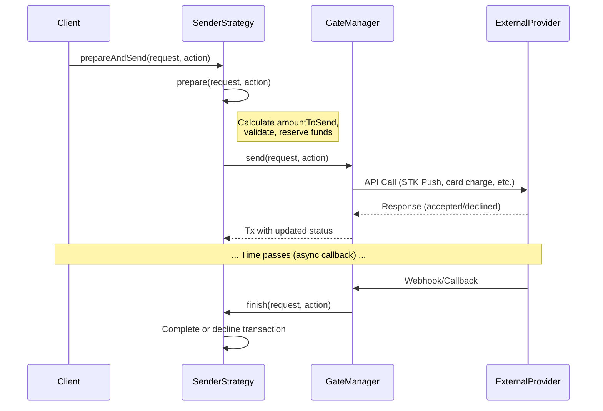

**Strategy implementations** in [gate/gate-services/src/main/java/sdk/finance/gate/service/impl/sender/](file:///Users/muchami/work/cashia-sdk-finance-backend-main/gate/gate-services/src/main/java/sdk/finance/gate/service/impl/sender/):

| Strategy | Purpose |
|----------|---------|
| `TopUpSenderStrategy` | Deposit flow |
| `RedeemSenderStrategy` | Withdrawal flow |
| `PurchaseSenderStrategy` | Product purchase flow |
| `RefundSenderStrategy` | Refund flow |
| `FormSenderStrategy` | Hosted payment form flow |
| `TokenizationSenderStrategy` | Card tokenization flow |
| `IssueCardSenderStrategy` | Card issuing flow |
| `TxCallbackSenderStrategy` | Callback-initiated flow |

### 5.6 Gate Transaction Status — FSM

[TxStatus](file:///Users/muchami/work/cashia-sdk-finance-backend-main/gate/gate-model/src/main/java/sdk/finance/gate/model/tx/TxStatus.java) implements `Transitionable<TxStatus>`:

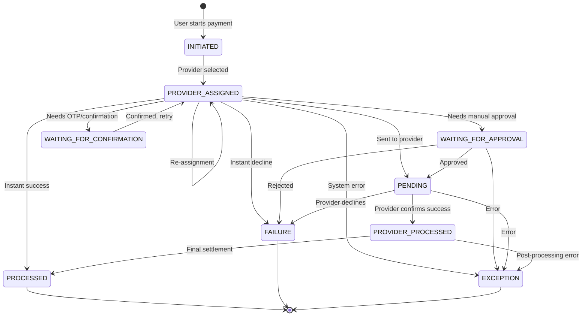

> [!IMPORTANT]
> `Transitionable` enforces transitions at runtime. Calling `tx.setStatus(PROCESSED)` when the current status is `INITIATED` will throw because `INITIATED` only allows `PROVIDER_ASSIGNED`.

---

## 6. Building Your Own Payment Gateway — Step by Step

### Step 1: Create the Module

```
gate-controllers/
└── my-gateway/
    ├── pom.xml                          ← depends on gate-services, integration module
    └── src/main/java/.../
        ├── MyGatewaySettings.java       ← extends Settings (config POJO)
        ├── MyGatewayManager.java        ← implements GateManager interfaces
        └── topup/
            ├── TopUpStrategy.java       ← Optional: strategy pattern for variants
            └── CallbackHandler.java     ← Optional: webhook processing
```

### Step 2: Define Settings

```java
@Data
public class MyGatewaySettings extends Settings {
    private String apiKey;
    private String merchantId;
    private String callbackUrl;
    // persisted as JSON in gate_provider.settings column
}
```

### Step 3: Implement GateManager Interfaces

```java
@Component
@RequiredArgsConstructor
public class MyGatewayManager implements
        TopUpSenderGateManager<MyGatewaySettings>,
        WithdrawalSenderGateManager<MyGatewaySettings>,
        ServerCallbackGateManager<MyGatewaySettings, JsonNode> {

    private final MyGatewayClient client;  // from integration module

    // === TopUp ===
    @Override
    public Tx send(Tx tx, Action action) throws TxDeclinedException {
        // 1. Extract payer data from tx
        // 2. Call external API via client
        // 3. Set tx.setExternalId(providerTxId)
        // 4. Set tx.setProcessing(amount, supportsFinishing, action)
        // 5. Return tx
    }

    @Override
    public boolean supportsTopUpFinishing() { return true; }

    @Override
    public Tx finishTopUp(Tx tx, Action action) {
        // Poll provider for final status
    }

    // === Callbacks ===
    @Override
    public Object parse(HttpServletRequest request) { /* parse webhook body */ }

    @Override
    public String extractId(RequestWrapper<JsonNode> request) { /* get tx ID */ }

    @Override
    public void onStatusChange(Tx tx, RequestWrapper<JsonNode> request,
                                HttpServletResponse response, Action action) {
        // Map provider status → TxStatus → tx.setProcessed() or throw TxDeclinedException
    }
}
```

### Step 4: Create Integration Client Module

```
integration/
└── my-gateway-integration/
    ├── my-gateway-client/
    │   ├── pom.xml
    │   └── src/main/java/.../MyGatewayClient.java  ← HTTP client (RestTemplate/WebClient)
    └── pom.xml
```

### Step 5: Add Application Configuration

```yaml
# application-my-gateway-gate-manager.yml
my-gateway:
  api-key: ${MY_GATEWAY_API_KEY}
  merchant-id: ${MY_GATEWAY_MERCHANT_ID}
  callback-url: ${MY_GATEWAY_CALLBACK_URL}
```

### Step 6: Register in Application

The gateway auto-registers via Spring component scanning. The `ControllerResolver` picks it up automatically. You then configure a `GateProvider` entity in the database linking the settings class to organizational/currency configuration.

---

## 7. Quartz Scheduling

Spring Boot Quartz integration is included via [core-manager/pom.xml](file:///Users/muchami/work/cashia-sdk-finance-backend-main/base/core/core-manager/pom.xml):

```xml
<dependency>
    <artifactId>spring-boot-starter-quartz</artifactId>
</dependency>
```

The [schedule](file:///Users/muchami/work/cashia-sdk-finance-backend-main/schedule) module provides the scheduling abstraction:

| Sub-module | Purpose |
|------------|---------|
| `schedule-model` | Job/Trigger entity definitions |
| `schedule-service-api` | Scheduling service interfaces |
| `schedule-service-impl` | Quartz-backed implementation |
| `schedule-endpoint` | REST API for job management |

Quartz is used for:
- **Recurring fee processing** (monthly fees)
- **Transaction expiration** (auto-expire pending transactions past TTL)
- **Reconciliation batch jobs** (scheduled matching of internal vs. external records)
- **Retry/polling** (check pending transaction status with external providers)

Quartz stores job metadata in PostgreSQL (`QRTZ_*` tables), ensuring **cluster-safe scheduling** — only one node in a cluster executes a given job trigger.

---

## 8. Reconciliation

The [reconciliation](file:///Users/muchami/work/cashia-sdk-finance-backend-main/reconciliation) module (310 files) handles the critical financial operation of **matching internal transaction records against external provider statements**:

```
reconciliation/
├── reconciliation-endpoint/     ← REST API for triggering/viewing reconciliation
├── reconciliation-model/        ← Entity definitions (ReconciliationRecord, etc.)
└── reconciliation-services/     ← Matching logic, asset comparison
```

Reconciliation records use `PESSIMISTIC_WRITE` locking to prevent concurrent matching of the same records. The deprecated `BusinessProcessStatus.not_reconciled` / `reconciled` / `reconciled_with_mismatch` statuses indicate that reconciliation status was historically tracked on the business process itself.

---

## 9. Cross-Cutting Concerns

| Module | Purpose |
|--------|---------|
| `commissions/` (197 files) | Commission rule engine — defines fee structures per organization, currency, transaction type |
| `compliance/` (118 files) | AML/CFT compliance checks, limits enforcement |
| `confirmation/` | OTP/2FA confirmation for sensitive operations |
| `encryption/` | Field-level encryption (PCI-DSS compliance) |
| `card-storage/` | Secure card storage (PCI vault) |
| `card-issuing/` | Card issuing via Marqeta integration |
| `investigations/` | Fraud investigations workflow |
| `subscription/` | Recurring payment subscriptions |
| `hosted-checkout/` | White-label checkout pages |
| `g3-core-platform/` | Integration with G3 core banking platform (external ledger) |
| `reports/` | Reporting and analytics (Kafka consumer → report generation) |

---

## 10. Key Architectural Patterns Summary

| Pattern | Where | Purpose |
|---------|-------|---------|
| **Optimistic Locking** (`@Version`) | All entities via `Entity` base class | Prevent silent concurrent overwrites |
| **Pessimistic Locking** (`SELECT FOR UPDATE`) | Coins, sequences, reconciliation | Prevent double-spend on high-contention rows |
| **Append-Only Ledger** | `Transaction` entity | Immutable audit trail, event-sourced balances |
| **Transactional Outbox** | `outbox_message` → Kafka | Exactly-once event publication guarantee |
| **CQRS** | PostgreSQL (writes) / MongoDB (reads) | Separate read/write models for performance |
| **Strategy Pattern** | `SenderStrategy`, `TopUpStrategy` | Pluggable payment execution pipelines |
| **Plugin Architecture** | `GateManager` → `ControllerResolver` | Hot-pluggable payment gateways |
| **Finite State Machine** | `TxStatus`, `BusinessProcessStatus` | Enforced valid state transitions |
| **Protobuf Serialization** | Kafka messages | Compact, schema-evolved binary encoding |
| **Quartz Scheduling** | `schedule` module | Cluster-safe recurring jobs |
| **Secure Memory** | `SecureRedisStore`, `SecureMemoryWiper` | PCI-compliant transient sensitive data |
| **Double-Entry Bookkeeping** | `Transaction(srcCoin → destCoin)` | Financial accounting integrity |
